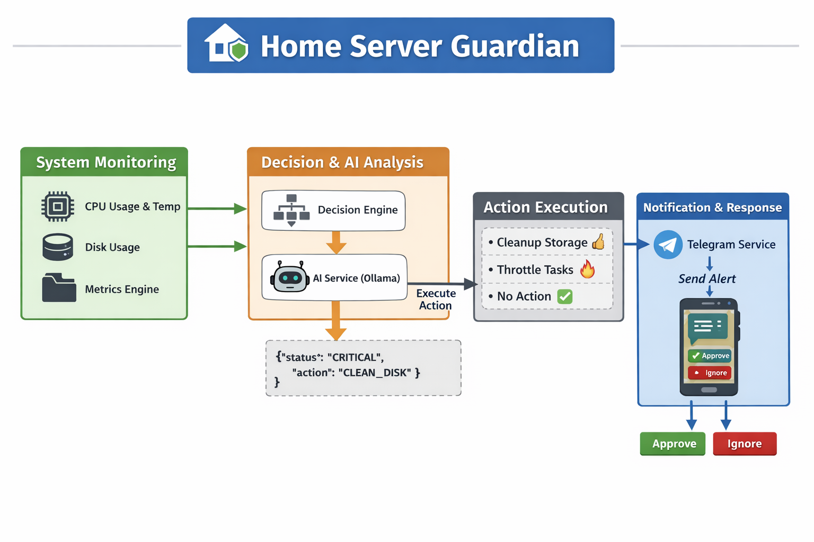

# 🛡️ Smart Home Server Guardian

An intelligent monitoring and automation system for personal home servers.  
This project combines Spring Boot, AI (Ollama), and Telegram Bot integration to monitor system health and take smart actions automatically.

---

## 🚀 Features

- 📊 Real-time system monitoring
    - CPU Usage
    - Disk Usage
    - CPU Temperature (if available)

- 🤖 AI-powered decision making
    - Uses Ollama (local LLM) to analyze system health
    - Generates status, message, and recommended action

- ⚙️ Automated system actions
    - Disk cleanup (planned)
    - Task throttling (planned)

- 📩 Telegram alerts
    - Sends alerts with interactive buttons
    - Smart notification system (no spam)

- ⏱ Background scheduler
    - Runs automatically every 1 minute
    - No manual triggering required

---

## 🏗️ Architecture

### 🔍 System Flow Diagram

  

## 🏗️ Tech Stack

- Java 17+
- Spring Boot
- Lombok
- REST APIs
- Ollama (Local AI Model)
- Telegram Bot API

---

## 📂 Project Structure

homeserverguardian
│
├── controller
│   └── SystemMetricsController
│
├── service
│   ├── SystemMetricsService
│   ├── AIService
│   └── TelegramService
│
├── engine
│   ├── MetricsEngine
│   ├── DecisionEngine
│   └── ActionEngine
│
├── model
│   ├── SystemMetrics
│   ├── SystemStatus
│   ├── SystemAction
│   └── AIResponse
│
├── util
│   └── SystemActionExecutor
│
└── config
└── AIConfig

---

## ⚙️ How It Works

1. Scheduler runs every minute
2. System metrics are collected
3. AI analyzes the system
4. Status is generated (HEALTHY / WARNING / CRITICAL)
5. Suggested action is determined
6. Telegram notification is sent (only when needed)

---

## 🧠 Example AI Output

{
"status": "WARNING",
"message": "Disk usage is high",
"action": "CLEAN_DISK"
}

---

## 📩 Example Telegram Alert

🤖 AI System Report

⚙️ CPU Usage: 35.21%  
🔥 CPU Temp: N/A ❌  
💾 Disk Usage: 82.45%

Status: WARNING  
Analysis: Disk usage is high  
Action: CLEAN_DISK

---

## 🔧 Configuration (application.yml)

ai:
ollama:
url: http://localhost:11434/api/generate
model: llama3

telegram:
bot:
token: YOUR_BOT_TOKEN
chat-id: YOUR_CHAT_ID

---

## ▶️ Running the Project

1. Clone repository

git clone https://github.com/RaninduAmarasinghe/home-server-guardian.git

2. Navigate to project

cd home-server-guardian

3. Run application

./mvnw spring-boot:run

---

## 🧪 API Endpoints

GET /metrics   → Get system metrics  
GET /status    → Get system status  
GET /action    → Get recommended action  
GET /execute   → Trigger AI + Telegram alert

---

## 📌 Notes

- CPU temperature may not be available on all systems (Mac/Windows limitation)
- AI responses depend on the Ollama model
- Alerts are optimized to avoid spam

---

## 🚀 Future Improvements

- Real disk cleanup automation
- CPU throttling integration
- Web dashboard (React)
- Docker support
- CI/CD pipeline

---

## 👨‍💻 Author

Ranindu Amarasinghe  

---